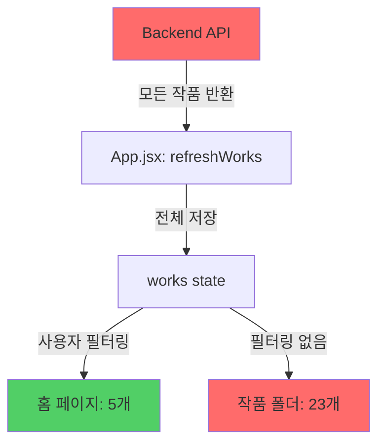

# [Critical] 홈 vs 작품폴더 데이터 불일치 버그

## 1. 이슈 개요 (Overview)
- **작성일**: 2026-01-22
- **작성자**: System Analysis
- **중요도**: High 🔴
- **상태**: Open

## 2. 환경 정보 (Environment)
| 항목 | 내용 |
| --- | --- |
| App Version | v1.4 |
| Browser/Engine | Chrome/Vite Dev Server |
| Backend | Node.js + Express + TiDB |
| Frontend | React 19 |

## 3. 재현 경로 (Steps to Reproduce)
1. 사용자 로그인 (예: `master@imery.com`)
2. **[홈]** 탭 이동 → "저장된 작품" 섹션 확인 → **5개 표시**
3. **[작품 폴더]** 탭 이동 → "전체 작품" 클릭 → **23개 표시**
4. 홈 페이지에 없는 작품이 작품 폴더에 존재함을 확인

## 4. 상세 내용 (Details)

### 기대 동작 (Expected Behavior)
- **[홈]** 페이지와 **[작품 폴더]** 페이지는 **동일한 사용자의 작품**만 표시해야 함
- 로그인한 사용자의 `user_id`에 해당하는 작품만 필터링되어야 함
- 작품 개수가 일치해야 함

### 실제 동작 (Actual Behavior)
- **[홈]** 페이지: 5개 작품만 표시 (사용자 필터링 적용됨)
- **[작품 폴더]** 페이지: 23개 작품 표시 (모든 사용자 작품 포함)
- **데이터 불일치**: 18개 작품 차이 발생

### 에러 로그 / 코드 분석

#### 1. API 엔드포인트 분석

**Backend: `server/index.js:120-129`**
```javascript
app.get('/posts/', async (req, res) => {
    const posts = await db.all(`
    SELECT Posts.*, Users.nickname,
    (SELECT COUNT(*) FROM Likes WHERE post_id = Posts.id) as like_count
    FROM Posts 
    LEFT JOIN Users ON Posts.user_id = Users.id 
    ORDER BY created_at DESC
  `);
    res.json({ posts });
});
```

**🔴 문제점**: 
- `WHERE user_id = ?` 조건이 **없음**
- **모든 사용자의 작품을 반환**
- 사용자 인증 정보를 받지 않음

#### 2. Frontend 데이터 처리 분석

**`App.jsx:64-120` - `refreshWorks()` 함수**
```javascript
const refreshWorks = async () => {
  if (!user) return;
  try {
    const [posts, myLikes, friends, bookmarks] = await Promise.all([
      api.getPosts(),  // ← 모든 작품 가져옴 (필터링 없음)
      api.getMyLikes(user.user_id),
      api.getFriends(user.user_id),
      api.getBookmarks(user.user_id)
    ]);
    
    // 모든 작품을 mappedWorks에 저장
    let mappedWorks = posts.map(post => ({...}));
    setWorks(mappedWorks);  // ← 전체 작품 저장
  }
};
```

**`App.jsx:360-380` - 페이지별 필터링**
```javascript
// ✅ 홈 페이지 - 사용자 필터링 있음
case 'archive':
  filteredWorks = works.filter(w => Number(w.user_id) === Number(user.user_id));
  break;

// ❌ 작품 폴더 페이지 - 필터링 없음
case 'works':
  // NO FILTERING - 모든 작품 표시
  break;
```

#### 3. 근본 원인 (Root Cause)



**원인 요약:**
1. **Backend**: `/posts/` API가 사용자 구분 없이 전체 데이터 반환
2. **Frontend**: `works` state에 모든 사용자의 작품 저장됨
3. **홈 페이지**: 명시적으로 `user.user_id` 필터링 적용 (정상)
4. **작품 폴더 페이지**: 필터링 로직 누락 (버그)

---

## 5. 해결 방안 (Resolution Plan)

### 방안 1: Backend API 수정 (권장) ✅

**장점**: 
- 클라이언트에서 불필요한 데이터 전송 방지
- 보안 강화 (다른 사용자 데이터 노출 차단)
- 네트워크 트래픽 감소

**수정 코드:**
```javascript
// server/index.js
app.get('/posts/', async (req, res) => {
    const { user_id } = req.query;  // 쿼리 파라미터로 user_id 받기
    
    if (!user_id) {
        return res.status(400).json({ error: 'user_id is required' });
    }
    
    const posts = await db.all(`
        SELECT Posts.*, Users.nickname,
        (SELECT COUNT(*) FROM Likes WHERE post_id = Posts.id) as like_count
        FROM Posts 
        LEFT JOIN Users ON Posts.user_id = Users.id 
        WHERE Posts.user_id = ?
        ORDER BY created_at DESC
    `, [user_id]);
    
    res.json({ posts });
});
```

**Frontend 수정:**
```javascript
// src/api/client.js
export const getPosts = async (userId) => {
  const { data } = await axios.get(`/posts/?user_id=${userId}`);
  return data.posts;
};

// App.jsx
const [posts, myLikes, friends, bookmarks] = await Promise.all([
  api.getPosts(user.user_id),  // user_id 전달
  api.getMyLikes(user.user_id),
  api.getFriends(user.user_id),
  api.getBookmarks(user.user_id)
]);
```

---

### 방안 2: Frontend 필터링 추가 (임시)

**`App.jsx` 수정:**
```javascript
case 'works':
  // 작품 폴더에서도 사용자 작품만 표시
  filteredWorks = works.filter(w => Number(w.user_id) === Number(user.user_id));
  break;
```

**단점**: 
- 여전히 모든 데이터를 받아옴 (보안 위험)
- 네트워크 낭비

---

## 6. 영향 범위 (Impact)

### 보안
- 🔴 **High**: 다른 사용자의 작품 데이터가 노출됨
- 로그인한 사용자가 다른 사용자의 모든 작품 정보를 받아옴

### 기능
- 🟡 **Medium**: 작품 폴더에 잘못된 데이터 표시
- 사용자 혼란 발생 가능

### 성능
- 🟡 **Medium**: 불필요한 데이터 전송 (23개 vs 5개)
- 사용자 증가 시 네트워크 부하 증가

---

## 7. 우선순위 및 처리 계획

| 단계 | 작업 | 담당 | 예상 시간 |
|------|------|------|----------|
| 1 | Backend API 수정 (`/posts/`) | Backend | 30분 |
| 2 | Frontend API 호출 수정 (`client.js`) | Frontend | 15분 |
| 3 | App.jsx refreshWorks 수정 | Frontend | 10분 |
| 4 | 테스트 및 검증 | QA | 20분 |

**예상 완료**: 1.5시간

---

## 8. 관련 파일

- [server/index.js:120-129](file:///Users/apple/Desktop/React/iMery/server/index.js#L120-L129)
- [src/App.jsx:64-120](file:///Users/apple/Desktop/React/iMery/src/App.jsx#L64-L120)
- [src/App.jsx:360-380](file:///Users/apple/Desktop/React/iMery/src/App.jsx#L360-L380)
- [src/api/client.js](file:///Users/apple/Desktop/React/iMery/src/api/client.js)
